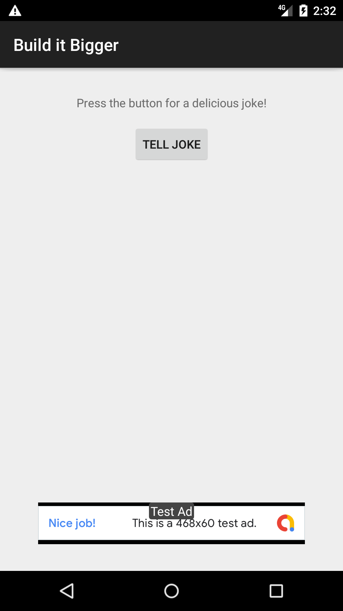
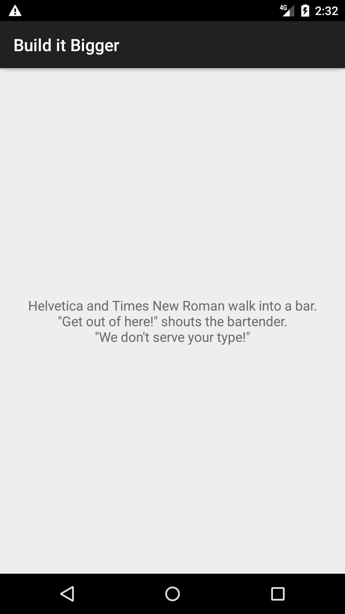

# Build It Bigger

## Project Overview

**Build It Bigger** app has multiple flavors that uses multiple libraries and Google Cloud Endpoints. It containes four modules:

- A Java library that provides jokes
- A Google Cloud Endpoints (GCE) project that serves those jokes
- An Android Library containing an activity for displaying jokes
- An Android app that fetches jokes from the GCE module and passes them to the Android Library for display

The project is part of the Udacity course: **Android Developer Nanodegree Program**.

## Why this Project

As Android projects grow in complexity, it becomes necessary to customize the
behavior of the Gradle build tool, allowing automation of repetitive tasks.
Particularly, factoring functionality into libraries and creating product
flavors allow for much bigger projects with minimal added complexity.

## Project requirements

- Project contains a Java library for supplying jokes.
- Project contains an Android library with an activity that displays jokes passed to it as intent extras.
- Project contains a Google Cloud Endpoints module that supplies jokes from the Java library. Project loads jokes from GCE module via an AsyncTask.
- Project contains connected tests to verify that the AsyncTask is indeed loading jokes.
- Project contains paid/free flavors. The paid flavor has no ads and no unnecessary dependencies.
- Ads are required in the free version.
- App retrieves jokes from Google Cloud Endpoints module and displays them via an Activity from the Android Library. Note that the GCE module need only be deployed locally.

## Setup GCE

Google Cloud Endpoints module works locally. To run a local instance of the GCE 
server you will have to install the Cloud SDK:

<https://cloud.google.com/sdk/docs/>

Once installed, you will need to follow the instructions in the Setup Cloud SDK
section at:

<https://cloud.google.com/endpoints/docs/frameworks/java/migrating-android>

Note: You do not need to follow the rest of steps in the migration guide, only
the Setup Cloud SDK.

Start or stop your local server by using the gradle tasks: backend -> Tasks -> app engine standard environment -> appengineStart and appengineStop.

Once your local GCE server is started you should see the following at 
[localhost:8080](http://localhost:8080)

## Screenshots

 &nbsp;&nbsp; 

